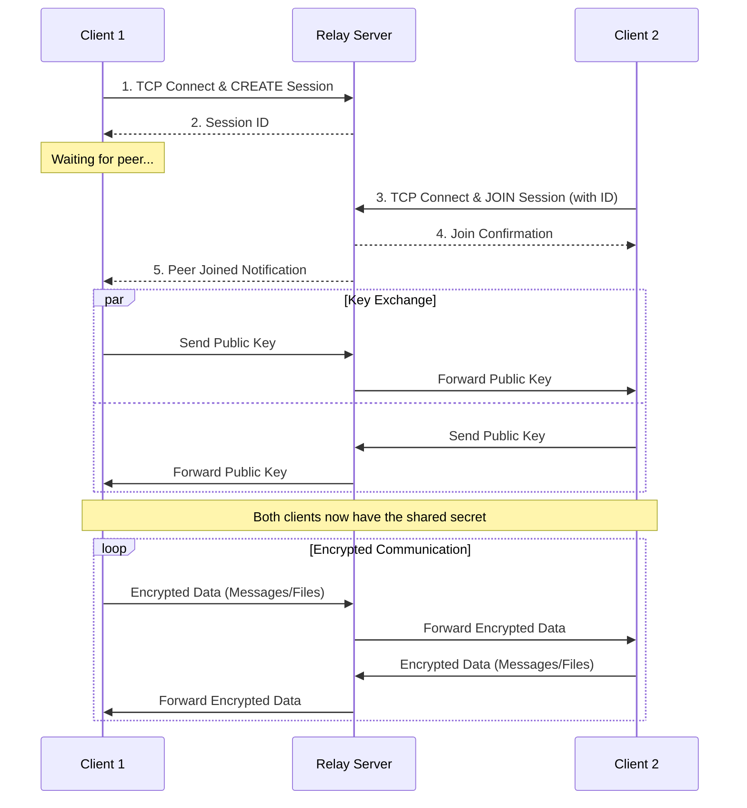

<p align="center">
  
</p>

# Jot: A Secure TUI Chat Application

> ⚠️ Security Warning  
> The private message and file features are experimental and have not been externally audited for security. They should be considered a work in progress and may contain vulnerabilities.

This project is the official Terminal User Interface (TUI) for Jot, created by the original author of [Hemmelig.app](https://github.com/HemmeligOrg/Hemmelig.app).

## What does Jot mean?

Jot is derived from Jötunvillur, a cipher rune set from Norse mythology. It is pronounced "yot".

The secure session is established using an **Elliptic-Curve Diffie-Hellman (ECDH)** key exchange over Curve25519. This ensures that all communication, including messages and file transfers, is protected with perfect forward secrecy for the duration of the session. The relay server facilitates the connection but is never able to decrypt the contents of the conversation.


## Features

- **End-to-End Encryption:** All messages and files are encrypted using **AES-256-GCM**. The 256-bit symmetric key is derived from a Curve25519 key exchange.
- **NAT Traversal:** The relay server allows clients to connect even when behind restrictive firewalls.
- **Secure File Transfer:** Securely send files between connected peers with a built-in 10MB size limit.
- **Terminal User Interface (TUI):** A responsive and user-friendly terminal UI that adapts to your window size.
- **Tab Completion:** Basic tab completion for file paths when using the `/send` command.
- **Trust On First Use (TOFU):** Verify peer identity through public key fingerprints.
- **Anonymous**: No user accounts or personal information required. Just run the client and start chatting.
- **Key pair generation**: Each session generates a new public/private key pair, ensuring that even if a session is compromised, past sessions remain secure.

## Installation

You can install the `jot` client by downloading a pre-compiled binary from the [GitHub Releases page](https://github.com/bjarneo/jot/releases) or by using the installation script below.

### Install Script (Linux & macOS)

This script will automatically detect your OS and architecture, download the latest binary, verify its checksum, and install it to `$HOME/.local/bin`.

```bash
curl -sSL https://raw.githubusercontent.com/bjarneo/jot/main/install.sh | sh
```

After installation, you may need to add the installation directory to your shell's `PATH`.

```bash
# For Bash users (usually in ~/.bashrc)
export PATH="$HOME/.local/bin:$PATH"

# For Zsh users (usually in ~/.zshrc)
export PATH="$HOME/.local/bin:$PATH"
```

## How to Use

### 1. Build the Applications

Ensure you have Go installed. Navigate to the project root directory and run:

```bash
go build -o jot ./cmd/jot
go build -o relay-server ./cmd/relay-server
```

### 2. Start the Relay Server

Run the relay server in a terminal. By default, it listens on port `8080`.

```bash
./relay-server
```

You can customize the server's behavior with the following flag:

- `-max-data-relayed <MB>`: Sets the maximum amount of data (in MB) a single session can relay before being terminated. Defaults to 50MB.

### 3. Start the Jot Client

Open a new terminal to start the client. You will be prompted to create or join a session.

```bash
./jot
```

The client can be customized with the following flags:

- `-relay-server <address>`: Specifies the address of the relay server (e.g., `localhost:8080`).

## Security Features

The relay server has been hardened against several common attacks:

- **Connection Flooding / Slowloris Attack:** The server enforces a 30-second timeout for new connections. If a client fails to send its initial `CREATE` or `JOIN` command within this window, its connection is dropped.
- **Bandwidth Exhaustion:** To prevent a malicious client from consuming unlimited bandwidth, the total amount of data that can be relayed in a single session is capped (default 50MB, configurable via the `-max-data-relayed` flag).
- **Inactivity Timeout:** Sessions are automatically terminated if no data is sent or received from either client for 5 minutes, freeing up server resources.

## Communication Flow



## Trust On First Use (TOFU)

**TOFU** is a security model where the first time you connect to a peer, you save their public key fingerprint. On all future connections, the client will verify that the fingerprint matches.

Important note: Jot creates new public/private key pairs for each session. This means that the fingerprint will change every time you start a new session.

In Jot, after the key exchange, the client displays the peer's fingerprint. It is crucial for you to **manually verify this fingerprint** with your peer through a trusted out-of-band channel (e.g., a phone call). This ensures your connection is secure and not being intercepted by a Man-in-the-Middle (MitM) attack.

## Disclaimer

This software is under active development and will change rapidly. It is provided "as is" and you use it at your own risk. The author is not accountable for any issues or damages that may arise from its use.
