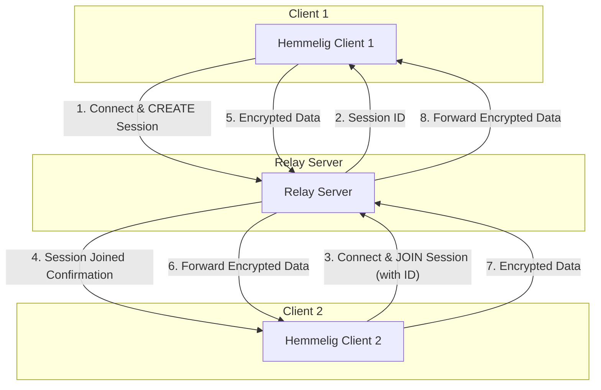

<p align="center">
  
</p>

# Hemmelig: Encrypted Chat with Relay Server

Hemmelig is a secure, end-to-end encrypted chat and file transfer application designed for direct peer-to-peer communication. It uses a **Relay Server** to overcome Network Address Translation (NAT) issues, allowing users behind restrictive firewalls to connect securely. The relay server acts as a simple, hardened switchboard, forwarding encrypted data between clients without ever decrypting or inspecting the messages.

## Features

- **End-to-End Encryption:** All messages and files are encrypted between the sender and receiver using Curve25519 for key exchange and AES-GCM for symmetric encryption.
- **NAT Traversal:** The relay server allows clients to connect even when behind restrictive firewalls.
- **Secure File Transfer:** Securely send files between connected peers with a configurable size limit (default 10MB).
- **Responsive UI:** A terminal-based UI that adapts to the window size and provides a user-friendly experience.
- **Tab Completion:** Basic tab completion for file paths when using the `/send` command.
- **Trust On First Use (TOFU):** Verify peer identity through public key fingerprints.

## How to Use

### 1. Build the Applications

Ensure you have Go installed. Navigate to the project root directory and run:

```bash
go build -o hemmelig ./cmd/hemmelig
go build -o relay-server ./cmd/relay-server
```

### 2. Start the Relay Server

Run the relay server in a terminal. By default, it listens on port `8080`.

```bash
./relay-server
```

You can customize the server's behavior with the following flag:
-   `-max-data-relayed <MB>`: Sets the maximum amount of data (in MB) a single session can relay before being terminated. Defaults to 50MB.

### 3. Start the Hemmelig Client

Open a new terminal to start the client. You will be prompted to create or join a session.

```bash
./hemmelig
```

The client can be customized with the following flags:
-   `-relay-server-addr <address>`: Specifies the address of the relay server (e.g., `localhost:8080`).
-   `-session-id <id>`: Immediately joins a session with the given ID without prompting.
-   `-max-file-size <MB>`: Sets the maximum size (in MB) for files you can send. Defaults to 10MB.

## Security Features

The relay server has been hardened against several common attacks:

-   **Connection Flooding / Slowloris Attack:** The server enforces a 30-second timeout for new connections. If a client fails to send its initial `CREATE` or `JOIN` command within this window, its connection is dropped.
-   **Bandwidth Exhaustion:** To prevent a malicious client from consuming unlimited bandwidth, the total amount of data that can be relayed in a single session is capped (default 50MB, configurable via the `-max-data-relayed` flag).
-   **Inactivity Timeout:** Sessions are automatically terminated if no data is sent or received from either client for 5 minutes, freeing up server resources.

## Communication Flow



## Trust On First Use (TOFU)

**TOFU** is a security model where the first time you connect to a peer, you save their public key fingerprint. On all future connections, the client will verify that the fingerprint matches.

In Hemmelig, after the key exchange, the client displays the peer's fingerprint. It is crucial for you to **manually verify this fingerprint** with your peer through a trusted out-of-band channel (e.g., a phone call). This ensures your connection is secure and not being intercepted by a Man-in-the-Middle (MitM) attack.