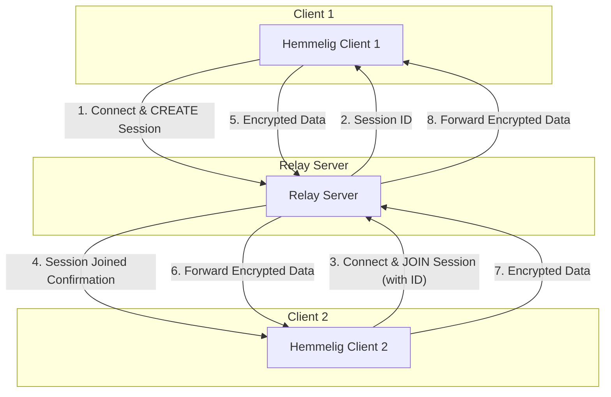

<p align="center">
  
</p>

# Hemmelig: Encrypted Chat with Relay Server

Hemmelig is a secure, end-to-end encrypted chat application designed for direct peer-to-peer communication. This version introduces a **Relay Server** to overcome Network Address Translation (NAT) traversal issues, allowing users behind restrictive firewalls to connect and chat securely. The relay server acts as a simple switchboard, forwarding encrypted data between clients without ever decrypting or inspecting the messages, thus preserving end-to-end encryption.

## Features

- **End-to-End Encryption:** All messages are encrypted between the sender and receiver using Curve25519 for key exchange and AES-GCM for symmetric encryption.
- **NAT Traversal via Relay Server:** Connect with peers even if you are behind a NAT or firewall, thanks to the dedicated relay server.
- **File Transfer:** Securely send files between connected peers.
- **Trust On First Use (TOFU):** Verify peer identity through key fingerprints.

## How to Use

To use Hemmelig with the relay server, you will need to run the relay server first, and then two Hemmelig client instances.

### 1. Build the Applications

Ensure you have Go installed. Navigate to the project root directory and run:

```bash
go build -o hemmelig ./cmd/hemmelig
go build -o relay-server ./cmd/relay-server
```

This will create two executable files: `hemmelig` (the client) and `relay-server` (the relay server).

### 2. Start the Relay Server

Run the relay server in a terminal. By default, it listens on port `8080`.

```bash
./relay-server
```

You should see output similar to:

```
2023/10/27 10:00:00 Relay server listening on :8080
```

### 3. Start Client 1 (Create a Session)

Open a new terminal and start the first Hemmelig client. Since `localhost:8080` is the default relay server address, you can simply run:

```bash
./hemmelig
```

You will be prompted to choose whether to `(C)reate` a new session or `(J)oin` an existing one. Choose `C` for create. Follow the prompts to enter your nickname. The client will connect to the relay server, create a new session, and display the generated **Session ID**. Make a note of this ID, as you will need to share it with your peer.

Example output:

```
Do you want to (C)reate a new session or (J)oin an existing one? (C/J): C
Enter your nickname (or press Enter for a random Mr. Robot name): Alice
New session created with ID: <GENERATED_SESSION_ID>. Share this ID with your peer.
```

### 4. Start Client 2 (Join the Session)

Open another new terminal and start the second Hemmelig client. You can also omit the `relay-server-addr` flag if using the default:

```bash
./hemmelig
```

You will be prompted to choose whether to `(C)reate` a new session or `(J)oin` an existing one. Choose `J` for join. Then, enter the **Session ID** obtained from Client 1. Follow the prompts to enter your nickname. Once connected, both clients will perform a key exchange, and you can start chatting securely.

Example output:

```
Do you want to (C)reate a new session or (J)oin an existing one? (C/J): J
Enter the session ID to join: <GENERATED_SESSION_ID>
Enter your nickname (or press Enter for a random Mr. Robot name): Bob
```

**Note:** You can still explicitly specify the relay server address using the `-relay-server-addr` flag if it's different from the default `localhost:8080`.

## Communication Flow (Mermaid Flowchart)



## Understanding TURN (Traversal Using Relays around NAT)

In networking, NAT (Network Address Translation) is a method of remapping one IP address space into another by modifying network address information in the IP header of packets while they are in transit across a traffic routing device. While beneficial for conserving public IP addresses, NATs can complicate direct peer-to-peer communication.

**TURN** (Traversal Using Relays around NAT) is a protocol that allows clients to send and receive data through a relay server when a direct connection (even with STUN for NAT traversal) is not possible. Hemmelig's relay server functions as a simplified TURN server. Instead of attempting to establish a direct connection, both Hemmelig clients connect to the central relay server. The server then simply forwards the encrypted data packets between the two clients in a designated session. This ensures that communication can occur regardless of the clients' network configurations, while maintaining the end-to-end encryption as the relay server never decrypts the messages.

## Trust On First Use (TOFU)

**TOFU** (Trust On First Use) is a security model where the first time a client connects to a server (or in this case, a peer), the client records the server's (or peer's) cryptographic key or fingerprint. On subsequent connections, the client verifies that the key or fingerprint matches the one previously recorded. If there's a mismatch, it indicates a potential Man-in-the-Middle (MitM) attack or a change in the peer's identity, and the client will warn the user.

In Hemmelig, after the key exchange, the client displays the peer's public key fingerprint. It is crucial for users to **manually verify this fingerprint** with their peer through a trusted out-of-band channel (e.g., verbally over a phone call, or via another secure messaging app). Once verified, you can trust that future communications with that peer, as long as the fingerprint remains the same, are secure and not being intercepted. If the fingerprint changes unexpectedly, it's a strong indicator of a security risk.
